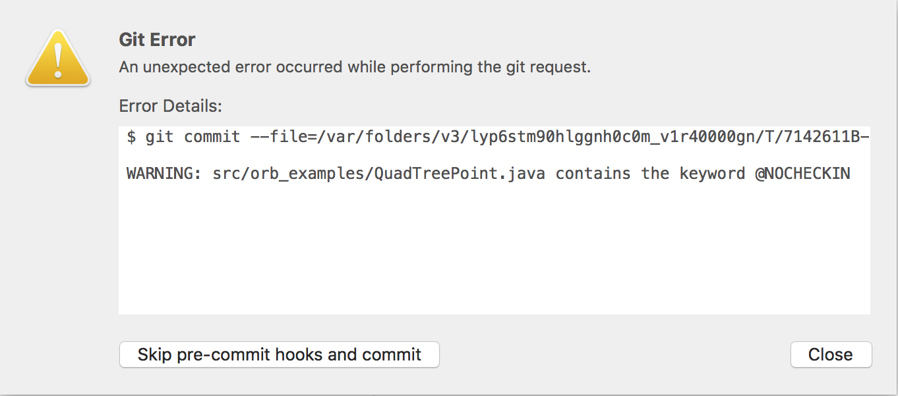

# @NOCHECKIN
A pre-commit hook that prevents from commiting if the text **@NOCHECKIN** is present in any of the staged files.

Special thanks to [ElpieKay](https://stackoverflow.com/users/6330106/elpiekay) who did all the hard work. Also thanks to 
[jthill](https://stackoverflow.com/users/1290731/jthill) for a slight improvement.

The original question and source can be found here:
https://stackoverflow.com/a/59133674/1022707

The reason I make a repository out of this is so people can watch it and will be notified if anyone will post an issue. Since so far this has not been heavily tested.

#### Changelog
- I modified the *pre-commit* hook so that it won't stage the other files that did not contain the @**NOCHECKIN**.

#### Usage

This `pre-commit` file should be placed inside `.git/hooks`.

#### Notes
For those interested, it also works with [Fork](https://git-fork.com/).

